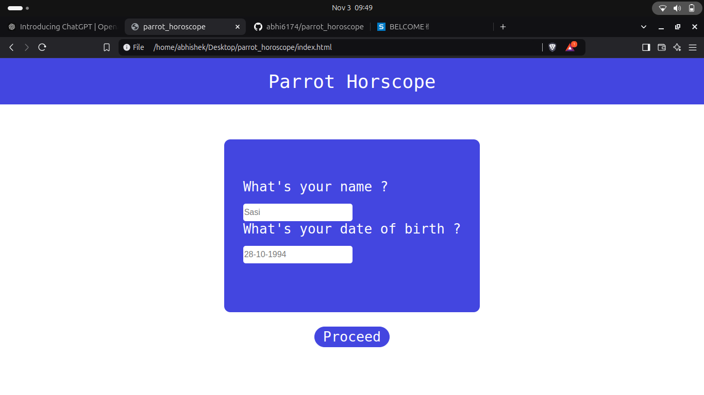
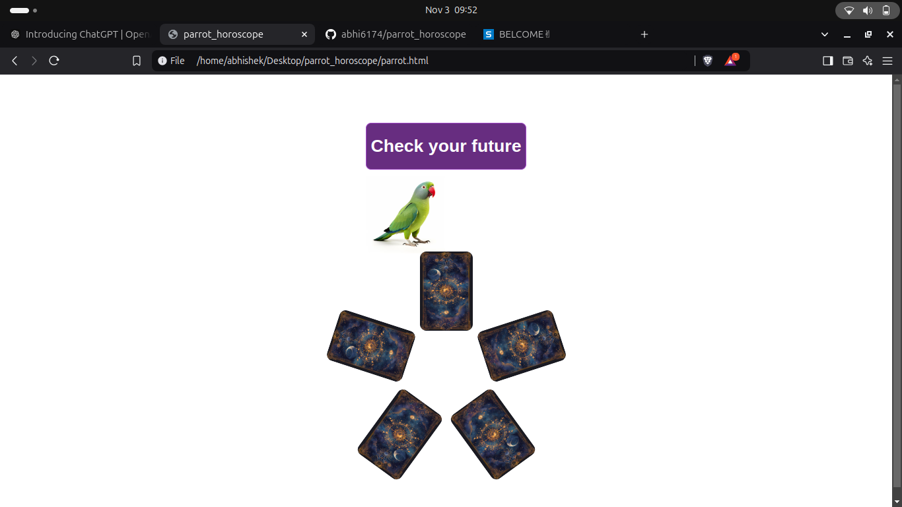
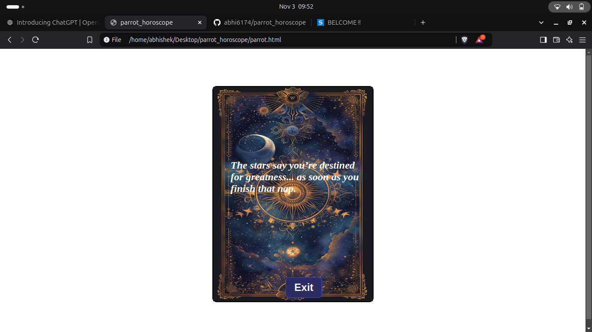

# [Project Name] 🎯
Parrot Horoscope

## Basic Details
### Team Name: []
single participant

### Team Members
- Team Lead: Abhishek S - Nss college of Engineering palakkad

### Project Description
It basically does check in to your future and give the card
that represent your future.

### The Problem (that doesn't exist)
Many people uses the traditional parrot based astrology.
But it is not available everywhere.Accessing the traditional Astrolegers is difficult .

### The Solution (that nobody asked for)
A digital parrot that pick cards that determine your future.
For those people who uses the traditional parrot based astrology this website can be useful.
## Technical Details
### Technologies/Components Used
For Software:
- HTML,CSS ,JAVASCRIPT

### Implementation
For Software:
# Installation
[commands]

# Run
Just open the index.html on a browser

### Project Documentation
For Software:

# Screenshots (Add at least 3)

It shows the interface to enter name and date of birth

It shows the parrot that's gonna pick the card.The card will rotate
and the parrot picks the card

It is the output card that represent your future

### Project Demo
# Video
https://youtu.be/YLH5-xYPoHU?si=nZkdfXDdenq28VxU
#Hosted-link
https://parrot-horoscope.netlify.app/

## Team Contributions
- ABHISHEK S: Made the Entire project

---
Made with ❤️ at TinkerHub Useless Projects 

